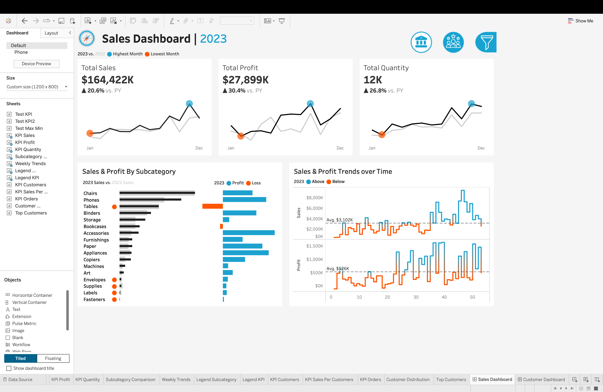
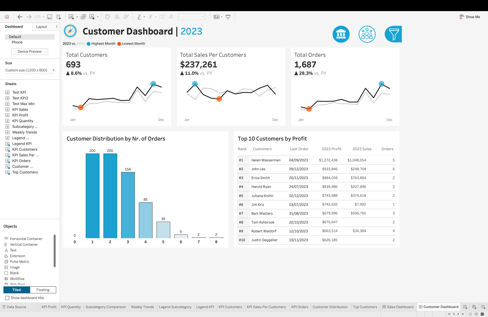

# 📊 Retail Sales & Customer Analytics Dashboard

An interactive Tableau dashboard built to analyze retail sales performance and customer behavior. The project enables users to explore key business metrics, compare year-over-year performance, and gain actionable insights through dynamic visualizations.

🔗 **Tableau Public:** *(https://public.tableau.com/app/profile/vaibhav.khelgi/viz/SalesCustomerDashboards_17824514420850/SalesDashboard?publish=yes)*

---

## 📌 Features

### Sales Dashboard
- Year-over-year comparison of Sales, Profit, and Quantity
- Monthly sales trends with highest and lowest months highlighted
- Sales & Profit analysis by product subcategory
- Weekly Sales and Profit trends with average performance indicators

### Customer Dashboard
- KPI overview of Customers, Sales per Customer, and Orders
- Monthly customer trends with YoY comparison
- Customer distribution by number of orders
- Top 10 customers ranked by profit

### Interactive Features
- Dynamic Year Selection
- Navigation between dashboards
- Interactive filtering by:
  - Category & Subcategory
  - Region, State & City

---

## 🛠 Tools & Technologies

- Tableau Public
- Tableau Desktop
- Calculated Fields
- Parameters
- Dashboard Actions
- CSV Data Sources
- 
---

## 📸 Dashboard Preview

### Sales Dashboard

### Customer Dashboard

---

## 👨‍💻 Author

**Vaibhav Khelgi**

- GitHub: https://github.com/VaibhavKhelgi
- LinkedIn: *https://www.linkedin.com/in/vaibhav-khelgi/*
- Tableau Public: *(https://public.tableau.com/app/profile/vaibhav.khelgi/vizzes)*
